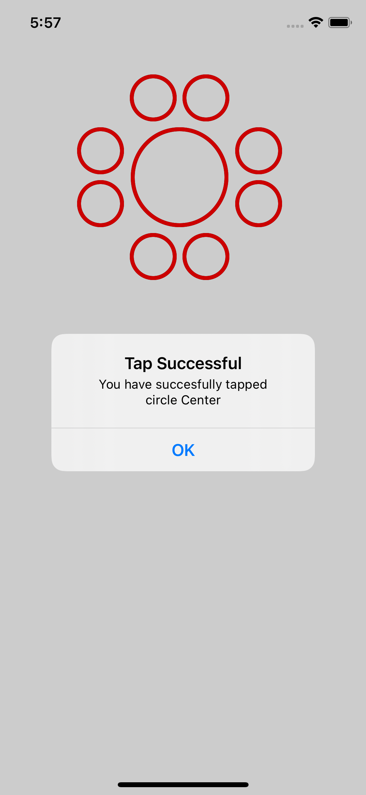
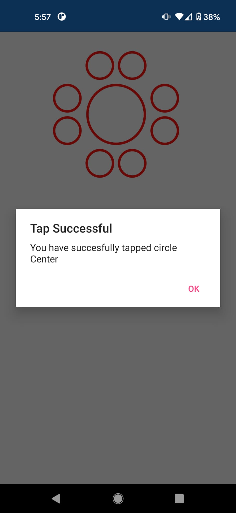

# TappableCircles
POC of tappable Circles UI in Xamarin.Forms, made leveraging the Shapes views specifically the `Ellipse` view and `TapGestureRecognizer`.

## Screenshots
| iOS | Android |
| :--: | :--: |
||  |
|  |